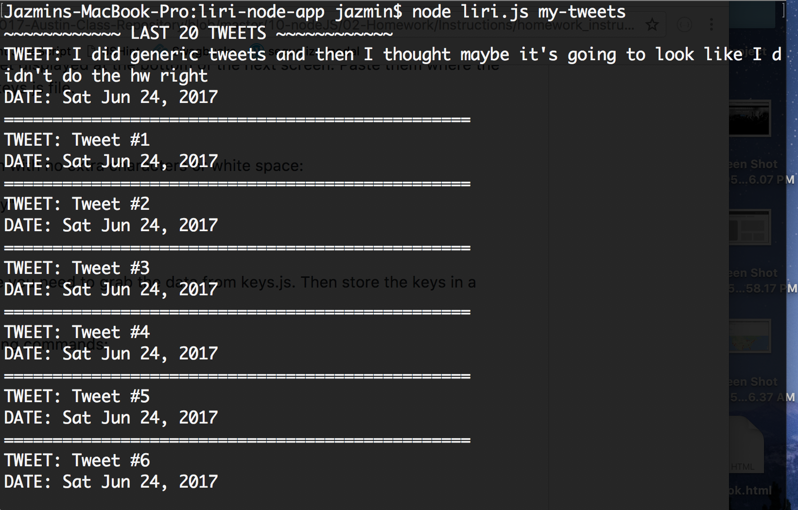
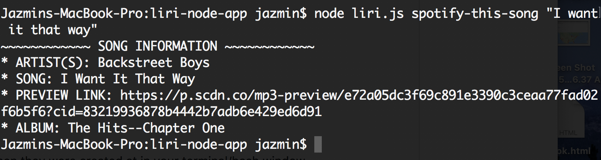
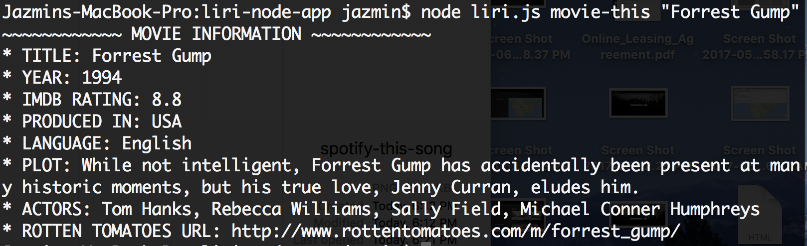

# LIRIBot

### Overview

LIRI is like iPhone's SIRI. However, while SIRI is a Speech Interpretation and Recognition Interface, LIRI is a Language Interpretation and Recognition Interface. LIRI will be a command line node app that takes in parameters and gives you back data. This was my first application integrating Node.js.

### How it Works

LIRI takes in the following commands:
* my-tweets
* spotify-this-song
* movie-this
* do-what-it-says

#### my-tweets

Run `node liri.js my-tweets`. This will show your last 20 tweets and when they were created at in your terminal/bash window.

#### spotify-this-song

Run `node liri.js spotify-this-song "<name_of_song>"`. 

* This will show the following information about the song in your terminal/bash window:
    * Artist(s)
    * The song's name
    * A preview link of the song from Spotify
    * The album that the song is from

#### movie-this

Run `node liri.js movie-this "<name_of_movie>"`. 

* This will output the following information to your terminal/bash window:
    * Title of the movie.
    * Year the movie came out.
    * IMDB Rating of the movie.
    * Country where the movie was produced.
    * Language of the movie.
    * Plot of the movie.
    * Actors in the movie.
    * Rotten Tomatoes URL.

#### do-what-it-says

Run `node liri.js do-what-it-says`. It will display song information for "I Want it That Way."
